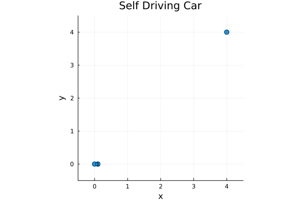
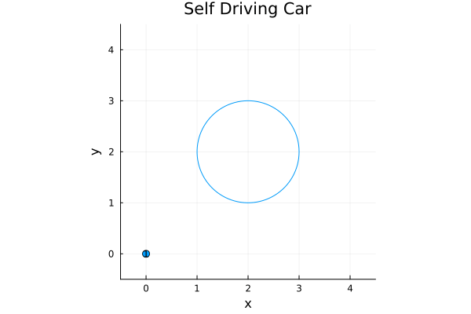
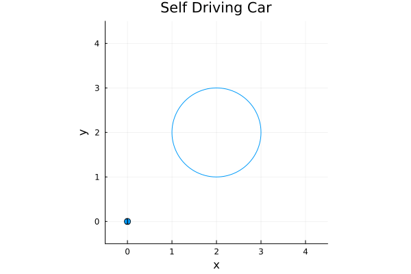
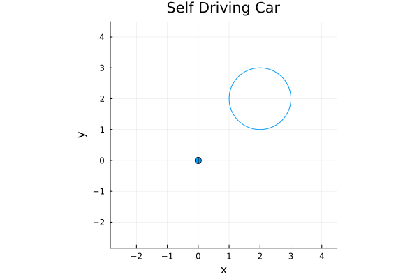
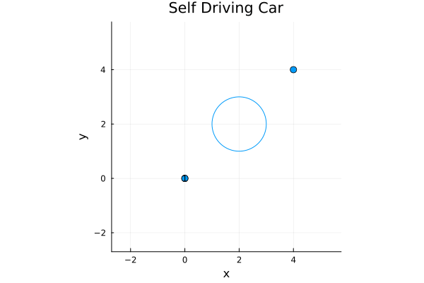

## Introduction
Extending from One Player Optimality, a way to incorporate obstacle avoidance into account is to assign a penalty when a player gets near the obstacle into our objective function. One way of doing such is adding a log barrier around each obstacle.

## Definition
Let the player at time $t$ have coordinates $[x_t,y_t]$. Define our obstacle as a circular zone with center at $[ox,oy]$ and radius $r$.

At time $t$, let 

$$D(t) =  \left((x_t-ox)^2 + (y_t-oy)^2\right)$$

This ensures that we are keeping track of the player's distance from the obstacle at every timestamp.

<blockquote style="color: #1e2f97; border-left-color: #1e2f97">
<b>Log Barrier Penalty</b>
</blockquote>

Our log barrier is defined as 

$$\alpha \cdot \sum_{t \in T} -\log(D(t) - r^2)$$

## Solution
Similar to One Player Optimality, we must manually take the Jacobian of our objective function, but also including our log-barrier.

<blockquote style="color: #1e2f97; border-left-color: #1e2f97">
<b>Jacobian of Objective Funcction</b>
</blockquote> 
In addition with minimizing the norm of the cost function, the entire Jacobian matrix of the objective function in Julia,

```julia
function gradient_f(z,model)
    grad_f = zeros(QuadExpr, 6*T) # z = [x;u] with size 4T + 2T
    for i in 4*T+1:6*T
        grad_f[i] = 2 * z[i]
    end
    denom = @variable(model,[1:T])
    for i in 1:T        
        @NLconstraint(model, denom[i] == 1/((z[4*i-3]-obstacle[1])^2+(z[4*i-2]-obstacle[2])^2-obstacle[3]^2))
        grad_f[4*i-3] = α * denom[i] * 2 * (z[4*i-3] - obstacle[1])
        grad_f[4*i-2] = α * denom[i] * 2 * (z[4*i-2] - obstacle[2])
    end
    return grad_f
end
```
Incorporating this to [One Player Optimality](https://github.com/Rich-Nyan/optimal/blob/main/OnePlayer.jl), the question remains to tune $\alpha$ accurately.
## Example
Suppose we are driving a car with initial state pose of $(0,0,0,1)$ and final state pose of $(4,4,\frac{\pi}{2}, 0)$. However, in the way stands an obstacle centered at $(2,2)$ and radius of $1$.

Absent of our obstacle constraint, the optimal trajectory is


_α=0_

Assigning an $\alpha$ value that is too low results in the trajectory solver almost completely ignoring the obstacle itself or glitching through the obstacle. For example,


_α=0.01_


_α=0.1_

Assigning an $\alpha$ value that is too large results in the trajectory solver afraid of being even near the obstacle, as the cost function would shoot up. For example,


_α=5_

A more precise $\alpha$ value results in,


_α=0.9_

## Improvements
Despite log barriers do assign a penalty that discourages a player from nearing an obstacle, limitations do still occur. Log barriers are rather difficult to tune, and the optimal $\alpha$ value is altered with different state poses and obstacles. Since log barriers are only an equality constraint, a more accurate solver would utilize non-equality constraints, that are able to set a hard limit on the obstacle.

## Code
See here: [Code](https://github.com/Rich-Nyan/optimal/blob/main/OnePlayerObstacle.jl)

