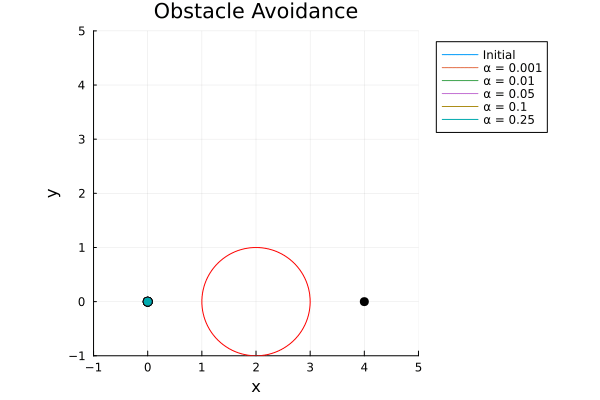
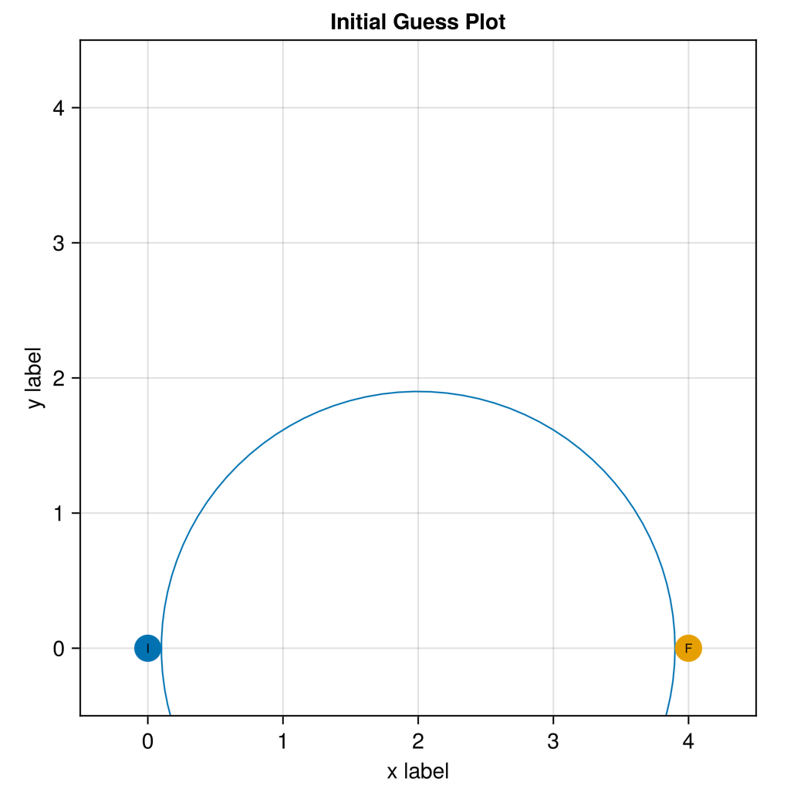
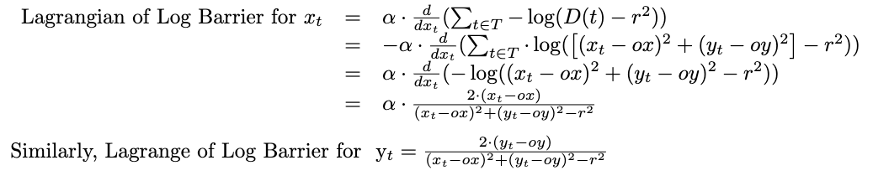
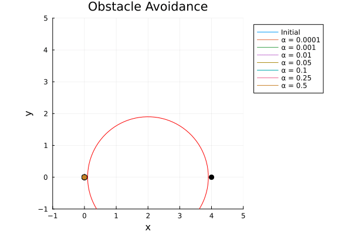
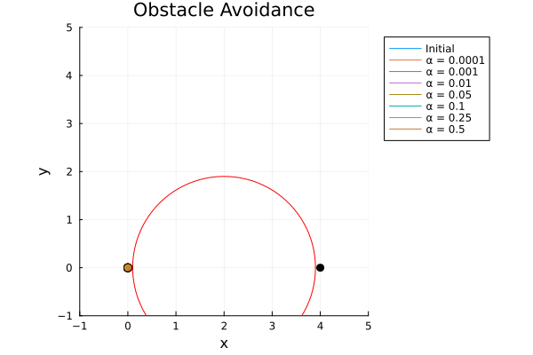
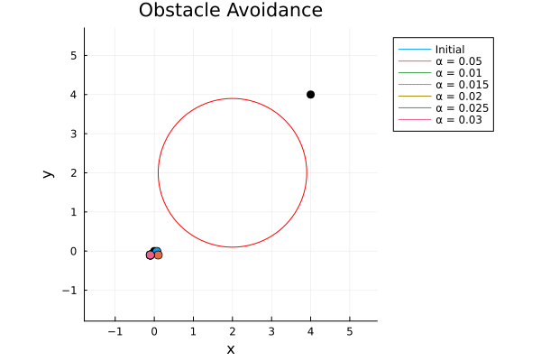

Obstacle-avoidance trajectory generation using log-barriers constraints and learning based on user-generated trajectories.



# Introduction
In the space of autonomous systems, how a robot interacts with its surroundings due to conflicting objectives stands as a crucial challenge. This game-theory simulation for collision avoidance is fed a user-provided initial trajectory into the solver, where the solver accounts for obstacles with a log-barrier penalty. This is crucial as a sufficient initial trajectory can greatly reduce the search space needed to find the optimal solution, improving the efficiency of the solver at a much faster rate.

To demonstrate this problem into practical sense, I will introduce a problem statement that will be solved through this post.

## Problem Statement
Suppose a robot starts at the origin and its objective is to reach the coordinate $(4,0)$ with minimal control inputs. An obstacle of radius $1.9$ sits centered at $(2,0)$, and the robot must not ever cross into the obstacle. What is the optimal trajectory?

{: w="400" h="400" }

## User Interface
We begin by feeding a user-built trajectory in Julia Makie. The [code](https://github.com/Rich-Nyan/DoubleIntegrator/blob/main/onePlayerObstacleGuessDI.jl) builds a trajectory off of detected mouseclicks and converts the drawn trajectory into a state vector in a file for our solver to read in.


## Obstacle-Avoidance Solver Introduction
At each time-frame $t \in [1,T]$ holds $(x,y,\dot{x},\dot{y})$, where $x$ represents the x-coordinate of the car, $y$ represents the y-coordinate of the car, $\\dot{x}$ represents the velocity in $x$-direction, and $\dot{y}$ represents the velocity in the $y$ direction. In addition, our control vector $u$, $u_{(1,t)}$ represents acceleration in $x$-direction and $u_{(2,t)}$ represents acceleration in $y$-direction. 

<blockquote style="color: #1e2f97; border-left-color: #1e2f97">
<b>Dynamic Feasibility</b>
</blockquote>

At each time-frame $t$, 

$$x_t - \big( x_{t-1} + dt \cdot \dot{x_{t-1}} \big) = 0 $$

$$y_t - \big( y_{t-1} + dt \cdot \dot{y_{t-1}} \big) = 0 $$

$$\dot{x_t} - \big( \dot{x_{t-1}} + dt \cdot u_{(1,t-1)}) = 0$$

$$\dot{y_t} - \big( \dot{y_{t-1}} + dt \cdot u_{(2,t-1)}) = 0 $$

### Penalty Definition
Let the player at time $t$ have coordinates $[x_t,y_t]$. Define our obstacle as a circular zone with center at $[ox,oy]$ and radius $r$.

At time $t$, let 

$$D(t) =  \left((x_t-ox)^2 + (y_t-oy)^2\right)$$

This ensures that we are keeping track of the player's distance from the obstacle at every timestamp.

<blockquote style="color: #1e2f97; border-left-color: #1e2f97">
<b>Log Barrier Penalty</b>
</blockquote>

Our log barrier is defined as 

$$\alpha \cdot \sum_{t \in T} -\log(D(t) - r^2)$$

Since $\alpha$ is a penalty weight, differing $\alpha$ values will result in differing optimal trajectories. 

## Solution
In addition to computing the Jacobian of our Dynamic Feasibility function, we must also manually take the Jacobian of our objective function that contains our log-barrier.

<blockquote style="color: #1e2f97; border-left-color: #1e2f97">
<b>Jacobian of Objective Funcction</b>
</blockquote> 
```julia
function gradient_f(z,model)
    grad_f = zeros(QuadExpr, 6*T) # z = [x;u] with size 4T + 2T
    for i in 4*T+1:6*T
        grad_f[i] = 2 * z[i]
    end
    denom = @variable(model,[1:T])
    for i in 1:T        
        @NLconstraint(model, denom[i] == 1/((z[4*i-3]-obstacle[1])^2+(z[4*i-2]-obstacle[2])^2-obstacle[3]^2))
        grad_f[4*i-3] = α * denom[i] * 2 * (z[4*i-3] - obstacle[1])
        grad_f[4*i-2] = α * denom[i] * 2 * (z[4*i-2] - obstacle[2])
    end
    return grad_f
end
```

Our [solver](https://github.com/Rich-Nyan/DoubleIntegrator/blob/main/onePlayerObstacleDI.jl) will be ran in Ipopt numerous times solving for the optimal trajectory at $\alpha$ values of $[0.0001,0.001, 0.01, 0.05, 0.1, 0.25, 0.5]$.

## Results



## Analysis
As seen, at $\alpha$ value of $0.0001$, the trajectory is most optimal. The trajectory at $\alpha$ value of $0.5$ is the worst, as the robot is penalized even being near the obstacle. Hence, as $\alpha$ approaches $0$ (but never $0$!), the trajectory will be more optimal.

I would like to point out that as long as our initial trajectory was sufficient enough (being outside the obstacle at all times), the optimal trajectories generated remained the same. 

Even if I were to draw stars,



Note that despite this problem demonstrating that a smaller alpha value is more optimal, this is not always the case. In fact, here is a case where the optimal value favors at $\alpha$ being $0.01$.



## Improvements
Despite log barriers do assign a penalty that discourages a player from nearing an obstacle, limitations do still occur. Log barriers are rather difficult to tune, and the optimal $\alpha$ value is altered with different state poses and obstacles. Since log barriers are only an equality constraint, a more accurate solver would utilize non-equality constraints, that are able to set a hard limit on the obstacle.

## Code
See here: [Code](https://github.com/Rich-Nyan/DoubleIntegrator)

